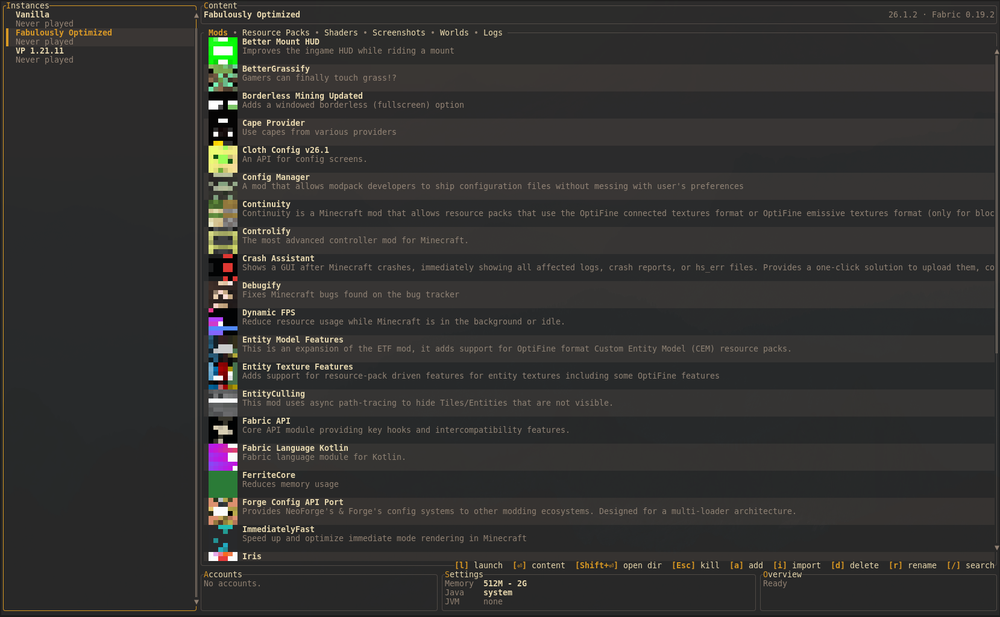

<div align="center">

# mcl

[![Contributors][contributors-shield]][contributors-url]
[![Forks][forks-shield]][forks-url]
[![Stargazers][stars-shield]][stars-url]
[![Issues][issues-shield]][issues-url]
[![GPL-3.0 License][license-shield]][license-url]

**M**ine**C**raft **L**auncher. or **M**ine**C**raft c**L**i. pick whichever sounds better to you.



[Report Bug](https://github.com/objz/mcl/issues) · [Request Feature](https://github.com/objz/mcl/issues)

</div>

---

## about

we all love TUIs. and we all know the official Minecraft launcher is not exactly a joy to use. so here's mcl, a fully featured Minecraft launcher that lives in your terminal. written in Rust because if you're replacing something bloated you might as well go all the way.

it does everything you'd expect from a launcher. multiple instances, mod loaders, modpack imports, Microsoft auth, content management, launching. all from a TUI or from the command line. the TUI is the main thing though, the CLI is there for scripting and automation.

## features

| | |
|---|---|
| **instances** | create and manage multiple instances, each with their own version, loader, mods, and settings |
| **mod loaders** | vanilla, Fabric, Quilt, Forge, NeoForge. more might show up later |
| **content** | browse and toggle mods, shaders, resource packs. view worlds, screenshots, and logs |
| **modpack import** | import from Modrinth via `.mrpack` file, URL, or slug |
| **accounts** | multiple Microsoft accounts and offline players, switch between them |
| **launching** | launch directly from the TUI or generate a desktop shortcut for any instance |
| **desktop shortcuts** | click it and Minecraft starts, no need to open mcl or type anything |
| **CLI** | every feature the TUI has is also available as a subcommand |
| **theming** | 10 built-in themes, custom themes, color overrides |

---

## authentication

mcl currently uses the Microsoft client ID from [portablemc](https://github.com/mindstorm38/portablemc) for Minecraft account authentication.

this is temporary while mcl is going through the official Microsoft/Minecraft app approval process. once approved, mcl will switch to its own client ID.

authentication still happens through Microsoft’s official services.

---

## installation

### Arch Linux

[](https://aur.archlinux.org/packages/mcl-launcher)
[](https://aur.archlinux.org/packages/mcl-launcher-bin)
[](https://aur.archlinux.org/packages/mcl-launcher-git)

```sh
# from source (release tarball)
paru -S mcl-launcher

# prebuilt binary
paru -S mcl-launcher-bin

# latest git
paru -S mcl-launcher-git
```

also available on [crates.io](https://crates.io/crates/mcl-launcher)

### from source

requires a Rust toolchain.

```sh
git clone https://github.com/objz/mcl.git
cd mcl
cargo build --release
```

### other platforms

mcl can be compiled for Linux, macOS, and Windows. right now it's only packaged for Arch Linux (AUR) but official packages for other platforms and package managers will be added continuously.

---

## where things live

| path | what |
|---|---|
| `~/.config/mcl/config.toml` | general config (paths, memory defaults, UI settings) |
| `~/.config/mcl/theme.toml` | theme, border style, color overrides |
| `~/.config/mcl/accounts.json` | accounts |
| `~/.local/share/mcl/instances/` | instances, each in its own directory |
| `~/.local/share/mcl/meta/` | cached game metadata, libraries, assets, loader profiles |

each instance has an `instance.json` for its config and a `.minecraft/` directory with the actual game files. standard layout, nothing weird.

---

## configuration

everything is configured through TOML files. `config.toml` for paths, default memory allocation, and UI behavior. `theme.toml` for theme selection and border style. you can also override individual colors without making a full custom theme.

---

## themes

mcl ships with 10 built-in themes:

`catppuccin` · `dracula` · `nord` · `gruvbox` · `one-dark` · `solarized` · `tailwind` · `tokyo-night` · `rose-pine` · `terminal`

you can create your own by dropping a TOML file in `~/.config/mcl/theme/` and referencing it by name, or point to an absolute path.

---

## contributing

contributions are welcome. fork it, branch it, PR it. see [CONTRIBUTING.md](CONTRIBUTING.md) for code style and project structure.

---

## license

GPL-3.0. see [LICENSE](LICENSE).

---

[contributors-shield]: https://img.shields.io/github/contributors/objz/mcl.svg?style=for-the-badge
[contributors-url]: https://github.com/objz/mcl/graphs/contributors
[forks-shield]: https://img.shields.io/github/forks/objz/mcl.svg?style=for-the-badge
[forks-url]: https://github.com/objz/mcl/network/members
[stars-shield]: https://img.shields.io/github/stars/objz/mcl.svg?style=for-the-badge
[stars-url]: https://github.com/objz/mcl/stargazers
[issues-shield]: https://img.shields.io/github/issues/objz/mcl.svg?style=for-the-badge
[issues-url]: https://github.com/objz/mcl/issues
[license-shield]: https://img.shields.io/github/license/objz/mcl.svg?style=for-the-badge
[license-url]: https://github.com/objz/mcl/blob/master/LICENSE
