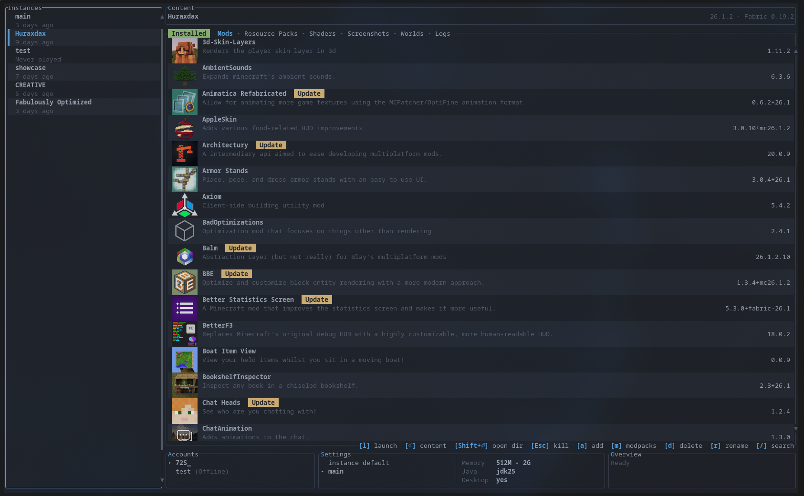
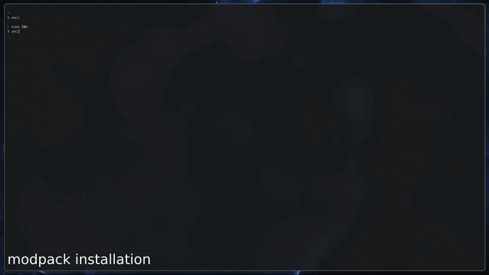

<div align="center">

# rmcl

[![Contributors][contributors-shield]][contributors-url]
[![Forks][forks-shield]][forks-url]
[![Stargazers][stars-shield]][stars-url]
[![Issues][issues-shield]][issues-url]
[![GPL-3.0 License][license-shield]][license-url]

**R**usty **M**ine**C**raft **L**auncher. or **R**ust **M**ine**C**raft c**L**i. pick whichever sounds better to you.



[Report Bug](https://github.com/objz/rmcl/issues) · [Request Feature](https://github.com/objz/rmcl/issues)

</div>

---

## about

we all love TUIs. and we all know the official Minecraft launcher is not exactly a joy to use (performance wise; no hatespeech here). so here's rmcl, a fully featured Minecraft launcher that lives in your terminal. written in Rust because if you're replacing something bloated you might as well go all the way.

it does everything you'd expect from a launcher. multiple instances, mod loaders, modpack imports, Microsoft auth, content management, launching. all from a TUI or from the command line. the TUI is the main thing though, the CLI is there for scripting and automation.



## features

| | |
|---|---|
| **instances** | create and manage multiple instances, each with their own version, loader, mods, and settings |
| **mod loaders** | vanilla, Fabric, Quilt, Forge, NeoForge. more might show up later |
| **content** | browse and toggle mods, shaders, resource packs. view worlds, screenshots, and logs |
| **modpack import** | import from Modrinth or MultiMC or GTNH via file, URL, or slug |
| **accounts** | multiple Microsoft accounts and offline players, switch between them |
| **launching** | launch directly from the TUI or generate a desktop shortcut for any instance |
| **CLI** | every feature the TUI has is also available as a subcommand |
| **theming** | 10 built-in themes, custom themes, color overrides |

---

## authentication

rmcl uses its own Microsoft client ID for Minecraft account authentication.

Authentication is performed through Microsoft’s official services.

## installation

### macOS / Linux

prebuilt archives are attached to each GitHub release.

```sh
# Homebrew
brew install objz/tap/rmcl
```

### Windows

release builds include a `.zip` archive and an `.msi`. WinGet and Chocolatey
packages are submitted from release CI and become available after review.

```powershell
# WinGet
winget install Objz.Rmcl

# Chocolatey
choco install rmcl
```

### Arch Linux

```sh
# from source (release tarball)
paru -S rmcl

# prebuilt binary
paru -S rmcl-bin

# latest git
paru -S rmcl-git
```

### Cargo

```sh
cargo install rmcl
```

### package status

release:

[](https://github.com/objz/rmcl/releases)
[](https://crates.io/crates/rmcl)

package managers:

[](https://github.com/objz/homebrew-tap)
[](https://winstall.app/apps/Objz.Rmcl)
[](https://community.chocolatey.org/packages/rmcl)

aur:

[](https://aur.archlinux.org/packages/rmcl)
[](https://aur.archlinux.org/packages/rmcl-bin)
[](https://aur.archlinux.org/packages/rmcl-git)

### from source

requires a Rust toolchain and a JDK (`javac` and `jar` on `PATH`).

```sh
git clone https://github.com/objz/rmcl.git
cd rmcl
cargo build --release
```

---

## where things live

### config & data

settings, accounts, instances, and cached game metadata.

| what | Linux | macOS | Windows |
|---|---|---|---|
| config (`config.toml`, `theme.toml`, `accounts.json`) | `~/.config/rmcl/` | `~/Library/Application Support/rmcl/` | `%APPDATA%\rmcl\` |
| instances | `~/.local/share/rmcl/instances/` | `~/Library/Application Support/rmcl/instances/` | `%LOCALAPPDATA%\rmcl\instances\` |
| metadata (versions, libraries, assets, loader profiles) | `~/.local/share/rmcl/meta/` | `~/Library/Application Support/rmcl/meta/` | `%LOCALAPPDATA%\rmcl\meta\` |

each instance has an `instance.json` for its config and a `.minecraft/` directory with the actual game files. standard layout, nothing weird.

### logs

launcher logs are per-session and contain rmcl's own output. instance launch logs capture game stdout/stderr per launch.

| what | Linux | macOS | Windows |
|---|---|---|---|
| launcher logs | `~/.cache/rmcl/` | `~/Library/Caches/rmcl/` | `%LOCALAPPDATA%\rmcl\` |
| instance launch logs | `<instances>/<name>/.minecraft/logs/launches/` | same | same |

---

## configuration

everything is configured through TOML files. `config.toml` for paths, default memory allocation, and UI behavior. `theme.toml` for theme selection and border style. you can also override individual colors without making a full custom theme.

---

## themes

rmcl ships with 10 built-in themes:

`catppuccin` · `dracula` · `nord` · `gruvbox` · `one-dark` · `solarized` · `tailwind` · `tokyo-night` · `rose-pine` · `terminal`

you can create your own by dropping a TOML file in `~/.config/rmcl/theme/` and referencing it by name, or point to an absolute path.

---

## contributing

contributions are welcome. fork it, branch it, PR it. see [CONTRIBUTING.md](CONTRIBUTING.md) for code style and project structure.

---

## license

GPL-3.0. see [LICENSE](LICENSE).

---

[contributors-shield]: https://img.shields.io/github/contributors/objz/rmcl.svg?style=for-the-badge
[contributors-url]: https://github.com/objz/rmcl/graphs/contributors
[forks-shield]: https://img.shields.io/github/forks/objz/rmcl.svg?style=for-the-badge
[forks-url]: https://github.com/objz/rmcl/network/members
[stars-shield]: https://img.shields.io/github/stars/objz/rmcl.svg?style=for-the-badge
[stars-url]: https://github.com/objz/rmcl/stargazers
[issues-shield]: https://img.shields.io/github/issues/objz/rmcl.svg?style=for-the-badge
[issues-url]: https://github.com/objz/rmcl/issues
[license-shield]: https://img.shields.io/github/license/objz/rmcl.svg?style=for-the-badge
[license-url]: https://github.com/objz/rmcl/blob/master/LICENSE
